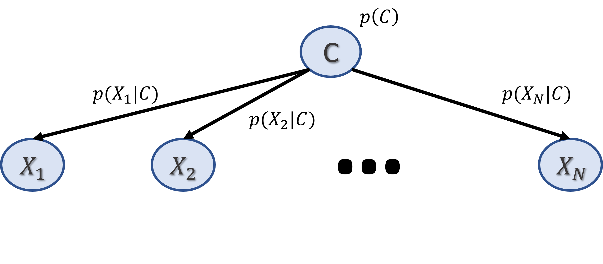

# Exploring Gene Expression using Naive Bayes Bayesian Network

## Description
This project was submitted as final project for the department of Computer Science at the Hebrew University of Jerusalem, under the instruction of Mrs. Ela Falik and Prof. Nir Friedman from the CS department.

We are model Gene Expression with the Naive Bayes model. Denoting the genes with $X_1,\ldots,X_N$, our assumption is that the genes are conditionaly independant given a hidden state of the cell, denoted by $C$.

  

We are also assuming that the prior distribution is $C\sim\mathrm{categorical}(\theta_C)$, with $\theta_C\in\mathbb{R}^K$ for some $K\in\mathbb{N}$.
As for the local models $p(X_i|C=k)$, aka the CPDs, we implemented a few options, including the categorical distribution, and two variants of the Negative Binomial distribution, one of them taking into consideration the sequencing depth of the samples.

A full description of the model and the results are discussed in detail in the `final_report.pdf`.

## Usage
Run the file `main.py` for running the algorithm. The output parameters will be printed to the stdout.

The file `plots.py` execute code that generate the plots of the results of our project - everything is in the `final_report.pdf`.

In the head of file `utils.py` there is all the configurations for the EM algorithm. The most important are:
- `CPD_CODE` (int) - Determine the distribution of the CPDs. Can take that values 0 for Categorical distribution, 1 for Negative Binomial distribution and 2 for Negative Binomial distribution that takes the sequencing depth of the samples into consideration.
- `REAL_DATA` (bool) - if False, then `main.py` run on synthetic dataset. If True, run the algorithm on the real genomic data from the directory `data`.
- `DATA_LOCATION` (str) - If running on real data, change this to the full path of the directory `data` in your station.

